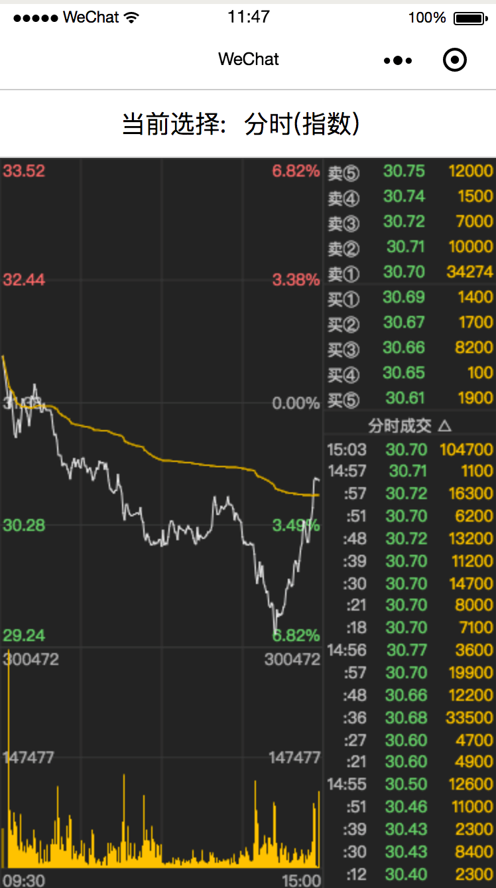
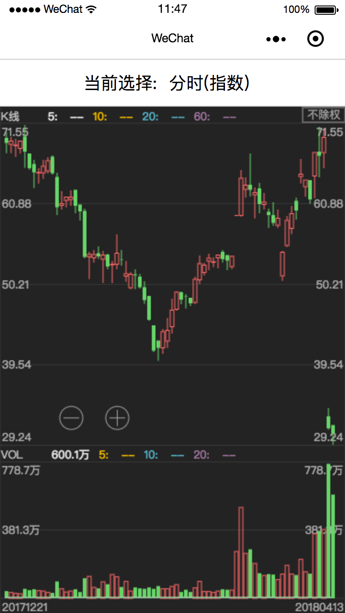
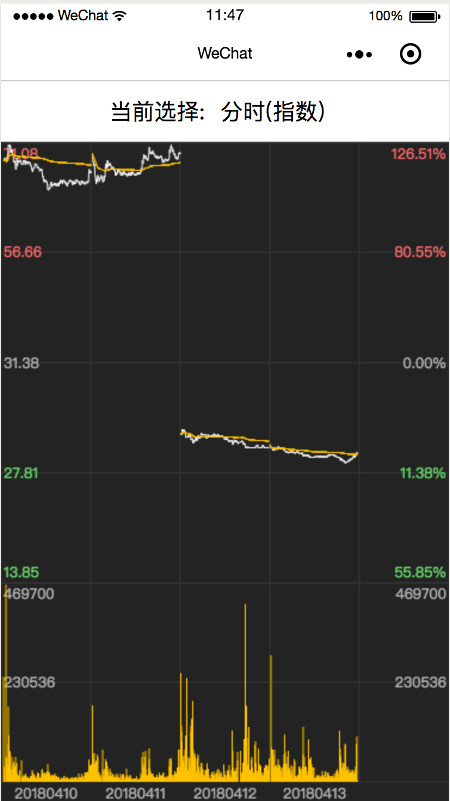

# Wechat applet clchart demo

This is a wechat mini app demo for [clchart]
(https://github.com/seerline/clchart)

## Setup

### 1. Checkout Source Code

```shell
git@github.com:seerline/wechat-applet-clchart-demo.git
```

### 2. Creating WeChat Applets with wechat-applet-clchart-demo as a Directory

## Screenshot





## License

Released under the [MIT License](http://opensource.org/licenses/MIT).